   
- 강인공지능은 어떤 문제를 실제로 사고하고 해결할 수 있는 컴퓨터 기반의 인공적인 지능을 만들어 내는 것, 다시 말해 소프트웨어를 이용한 인간 수준의 지능을 구현하는 것.
- 약인공지능은 기존에 인간은 쉽게 해결할 수 있으나 컴퓨터로 처리하기에는 어려웠던 작업을 컴퓨터로 수행하게 만드는데 중점을 둔 것, 다시 말해 특정 지능이 필요한 일을 자동화하기 위한 것.

#### AI와 일반적인 프로그램의 차이 
- 일반적인 소프트웨어 : 미리 정해진 알고리즘을 따라서 특정 업무를 수행한다.
- AI : 
    1. 정해진 절차를 따라 수행하기 어려운 일에 특화됨.
    1. 변화하는 환경에서도 스스로 문제에 적응함.
    1. 불확실성이나 모호함이 내포된 상황이나 문제에서 결정을 내릴 수 있음.
      - 바둑 게임 등

### 기계학습의 정의
컴퓨터가 코드로 명시하지 않은 동작을 데이터로부터 학습하여 실행할 수 있도록 하는 알고리즘을 개발하는 연구 분야.

#### 기계학습의 구조
크게 입력과 출력(결과), 학습 가능한 프레임워크(알고리즘)로 구성된다.

1. 입력 : 사진, 영상, 목소리 등과 같은 데이터.
1. 출력(결과) : 입력된 데이터가 학습 가능한 프레임워크를 통한 결과.
1. 학습 가능한 프레임워크 : 기계학습의 핵심으로써 샘플을 사용한 학습을 통해 원하는 결과를 만들 수 있도록 만들어진 수학적 알고리즘.

인공지능 Agent에게 다양한 입력 데이터를 제공하여 지능이 전제된 결과를 만들어 낼 수 있다. 학습은 이 Agent의 알고리즘을 학습하여 가중치를 계산하는 과정이며, 이는 Parameters/Structure에 해당하는 부분이다.

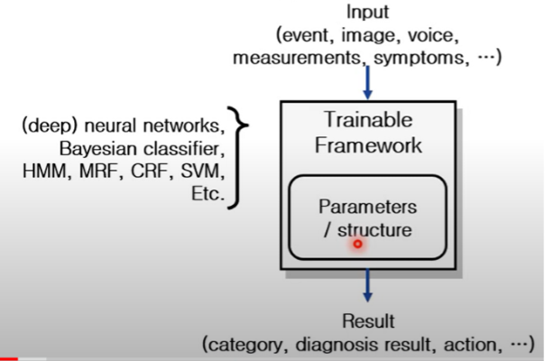

#### 기계학습의 종류

##### 지도학습 (Supervised Learning)
지도학습에는 알고리즘에 주입되는 학습 데이터에 **레이블 (데이터가 의미하는 답)**이라는 값이 포함되어 있다. 다시 말해, 정답이 있는 데이터를 통해 알고리즘을 훈련 시키는 것이다.

학습 과정에서 입력 값이 주어지면, 입력 값에 대한 레이블도 준다.

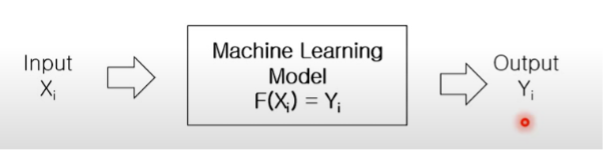

###### 사용되는 알고리즘
- K-nearest neighbors (K-최근접 이웃)
- linear regression (선형 회귀)
- logistic regression (로지스틱 회귀)
- Support Vector Machine[SVM] (서포트 벡터 머신)
- decision tree & random forest (결정트리 & 랜덤 포레스트)
- neural networks (신경망)

##### 비지도 학습 (Unsupervised Learing)
비지도 학습은 지도학습과는 반대로 훈련 데이터에 레이블이 없다.

비지도 학습을 이용해
1. Clustering : 비슷한 데이터끼리 그룹을 만들어 군집의 특징을 파악하거나 분포를 판단하는데 사용.
1. Reproduction : 제공받은 데이터의 중요 특징들을 기억하여 출력에 반영한다.
1. Latent variable models (Hidden factor analysis) : 어떤 데이터의 특징을 관찰한 뒤, 그 특징이 발현된 이유를 역으로 추적함.

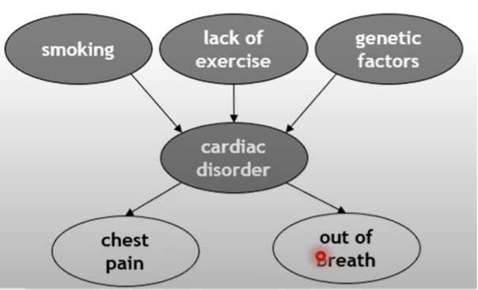

###### 사용되는 알고리즘
- 군집
    - K-means (K-평균)
    - DBSCAN
    - HCA (계층 군집 분석)
    - 이상치 탐지와 특이치 탐지
    - one-class SVM (원-클래스)
    - isolation forest

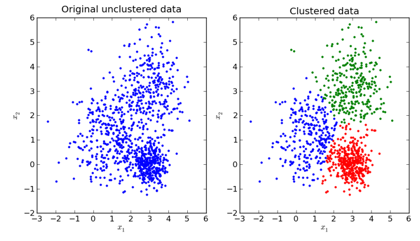

- 예시
    1. 신용카드 부정 사용 탐지, 구매 패턴 분석 등 소비자 행동 특성을 그룹화하는데 사용된다.
    1. 어떤 소비자와 유사한 특성을 갖는 집단을 구분하게 되면, 같은 집단 내의 다른 소비자를 통해 새로운 소비자의 구매 패턴이나 행동 등을 예측하는데 활용할 수 있다.

- 시각화와 차원축소
    - PCA (주성분 분석)
    - Kernel PCA
    - LLE (지역적 선형 임베딩)
    - t-SNE
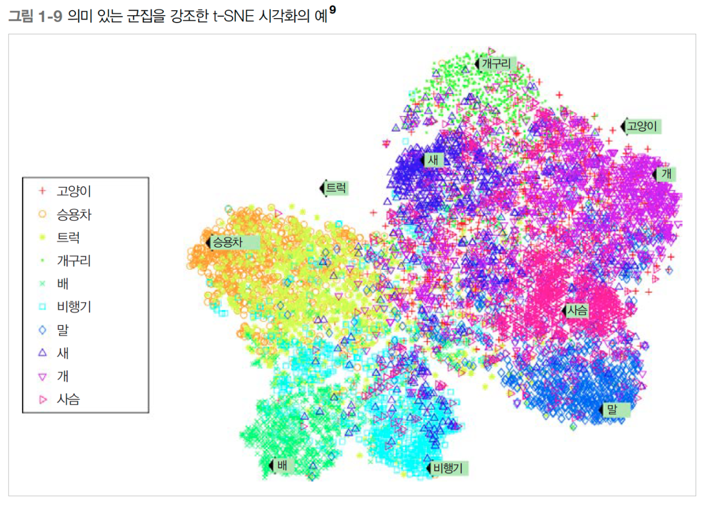

- 연관 규칙 학습
    - 어프라이어리
    - 이클렛

##### 준지도 학습 (Semi-supervised Learning)
간단히 말하면 지도학습과 비지도학습을 결합한 학습이다.

레이블이 있는 데이터와 없는 데이터 모두를 사용하여 예측에 사용한다.

레이블링된 데이터를 찾기 어려운 경우 활용되는 방법이다.

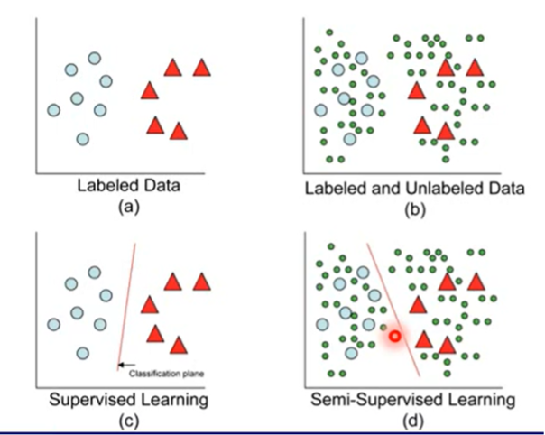

위 사진 처럼, 레이블된 데이터 주변에 레이블되지 않은 데이터를 추가하여 구분선 결정을 쉽게 만든다.

###### 사용되는 알고리즘
- Deep Belief Network[DBN] (심층 신뢰 신경망)
- Restricted Boltzmann Machine[RBM] (제한된 볼츠만 머신)

##### 강화학습 (Reinforcement Learning)
학습하는 시스템을 Agent라고 부르며 환경(Environment)을 관찰해서 행동(Action)을 실행하고 그 결과로 보상(Reward)을 받는다.

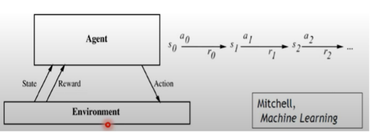

시간이 지나면서 가장 큰 보상을 얻기 위해 정책(policy)이라고 부르는 최상의 전략을 스스로 학습한다.

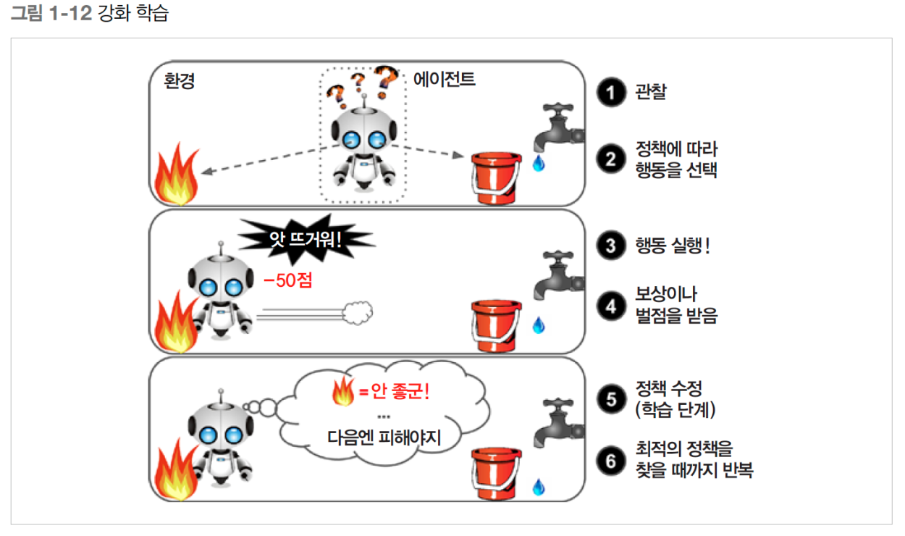

###### 강화 학습에 사용되는 용어
- 1. Policy : 상황이 주어졌을 때 해야하는 행동에 대한 확률 (조건부 확률)
    - $P(a|s)$
- 2. Value of State : 각 상황이 끝으로 갈 수록, 전체 행동 결정에 대한 확신
- 3. Value of Action (Q-Function) : 어떤 상황에서 어떠한 행동을 취했을 때, 그 결정이 다음 상황에 미칠 영향

> 어떤 행동이 좋은 결과를 야기하면 그 행동의 확률을 높이고, 반대일 경우 그 행동의 확률을 낮춘다.

###### 예시 (AlphaGo)
- 기존에 바둑을 둘 때는 Tree Search 기법을 통해 바둑판에 둘 수 있는 경우의 수 중 최적의 수를 찾아 돌을 두었다. 하지만 이 기법은 고려해야 할 경우의 수가 너무 많다는 문제점을 갖고 있다. 
- 따라서 효율적으로 알고리즘을 사용하기 위해서는 탐색할 경우의 수를 좁힌 다음 그 범위만 탐색한다. 
- 위의 행동은 2가지 Network를 통해 작동된다.
    1. Policy network 
        + 입력 데이터는 바둑판의 현재 국면이 되며, 다음 수를 어디 두는 게 좋은지 확률을 계산한 뒤 그 확률을 바둑판에 막대 그래프 형식으로 표시한다. 그 표시된 그림을 바탕으로 확률이 비교적 높은 수들을 다음 수로 활용한다.  
        + 계산해야 할 경우의 수를 줄여준다는 장점이 있다.
            - 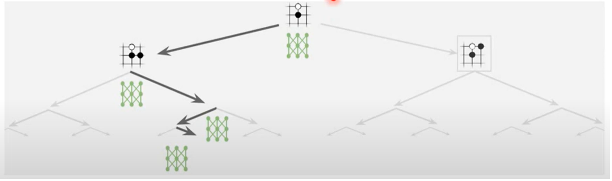
    2. Value network 
        + 해당 국면에서 바둑을 계속 둘 경우 이길 확률이 얼마일지 계산한다.
        + 계산해야 할 단계를 줄여준다는 장점이 있다.
            - $y\approx F(X;\theta)$
- 즉 Policy network를 통해 착수할 다음 돌의 경우의 수를 줄여주고, Value network를 통해 그 돌을 두었을 때 이길 확률을 계산한다.

###### 사용되는 알고리즘
- Deep Q-Networks[DQN]
- Double DQN
- actor-critic (액터-크리틱 알고리즘)
- Asynchronous Advantage actor-critic (A3C)
- Soft actor-critic (SAC)

### Recognition System
크게 분류(Classification)와 회귀(Regression)로 나눌 수 있다.

- 분류 : Class를 예측하는 것. 다시 말해 새로운 데이터가 어떤 분류의 데이터인지 분류하고 그에 따른 동작을 취하는 것.
    - 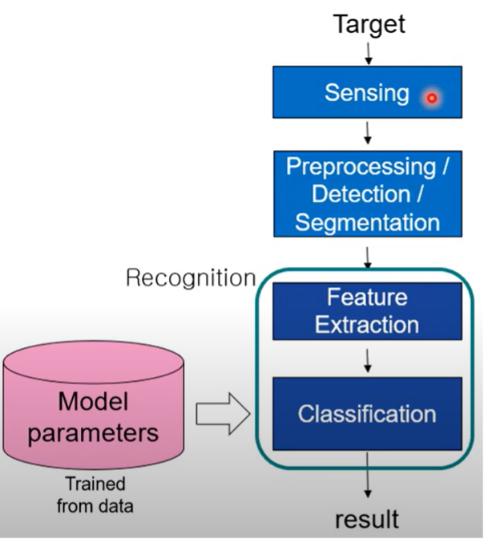
    - 예시
        1. 내가 받은 메일이 스팸매일인지 아닌지, 누군가가 나에게 보낸 메세지가 욕설이냐 아니냐와 같이 대답이 **예 / 아니오**로 구분될 수 있는 문제.
        1. 입력 데이터 Text가 어느 언어인지 분류하는 문제.

- 회귀 : 입력 데이터간의 특징을 기반으로 값들이 어떻게 분포하는지 예측하는 것. 다시 말해 각 변수간의 상관성을 예측하고 분석하는 것.
    - 
    - 종류
        - 선형 회귀
        - 비선형 회귀
        - 로지스틱 회귀
            - 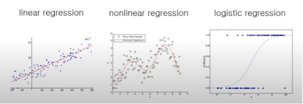
    - 예시
        1. 지하철 역과의 거리, 일정 거리안의 관공서, 마트, 학군의 수 등등 여러 특징들을 활용하여 어떤 지역의 땅값을 예측하는 문제
        1. 누군가의 키와 몸무게를 예측하는 문제

- 분류와 회귀의 구분법
    - 분류는 Class를 예측하므로 결과값이 확률로 주어짐. (0 ~ 1사이)
    - 회귀는 확률을 예측하는 것이 아니라, 값들의 연속성 중에 어디에 분포하고 있는지를 결정하는 것.
        - 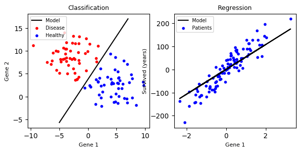

#### 입력 데이터의 패턴이 벡터로 변환되는 이유
- 1. 데이터를 다루기 쉬워진다.
    - 데이터의 크기가 변하더라도 고정된 크기의 벡터로 입력을 받아 보다 효율적으로 정보를 추출할 수 있다.
- 1. 중요한 정보만 핵심적으로 접근할 수 있다.
- 1. 시간을 단축할 수 있다.

### Complexity and Generalization Ability
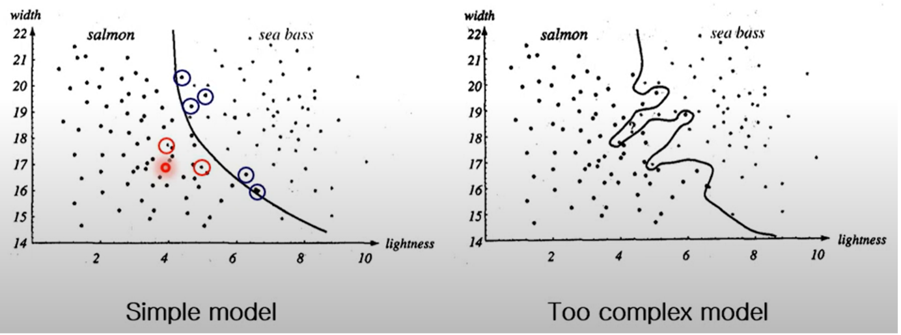

위 사진과 같이 잘못 분류된 데이터까지 모두 정확하게 분류하기 위해 분류의 경계를 복잡하게 할 경우, 더 많은 오류가 발생할 수 있다.
    - 위의 데이터는 학습용 데이터로만 이뤄져 있는데, 소수의 오분류된 데이터로 인해 데이터의 분류 기준이 매우 복잡해진다.
    - 이러한 상황을 Overfiting(과적합) 라고 부르며, 복잡한 모델에서 발생하는 현상이다.
        - 과적합 상태에서는 학습 데이터에서 오류율이 낮으나, 테스트 데이터에서는 오류율이 증가하는 경향을 보인다.
            - 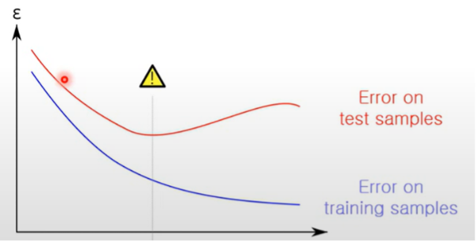

### 베이즈 정리
베이즈 정리는 사건 $B$가 발생함으로써 사건 $A$의 확률이 어떻게 변화하는지를 표현한 정리이다. 일반적으로 측정하기 어려운 확률을 예측해 볼 수 있도록 도움을 준다.

이를 다음의 수식으로 표현할 수 있다.

$P(A|B) = \frac{P(B|A)P(A)}{P(B)}$

- $P(A)$ : 사전 확률 (사건$B$가 발생하기 전의 사건 $A$의 확률)
- $P(A|B)$ : 사후 확률 (사건 $B$가 발생한 후의 사건 $A$의 확률)
- $P(B|A)$ : 우도 (사건 $A$가 발생한 경우 사건 $B$의 확률)
- $P(B)$ : 정규화상수 (확률의 크기 조정)

증명은,

$P(A|B) = \frac{P(A,B)}{P(B)} \rightarrow  P(A,B) = P(A|B)P(B)$

$P(B|A) = \frac{P(A,B)}{P(A)} \rightarrow P(A,B) = P(B|A)P(A)$

$P(A,B) = P(A|B)P(B) = P(B|A)P(A)$

$P(A|B) = \frac{P(B|A)P(A)}{P(B)}$

로 할 수 있다.

## Neural Network Basics
기본적으로 신경망은 생물학적 뇌세포를 모방하여 만든 수학적 모델이다. 아래의 사진과 같이 여러개의 뉴런이 서로 연결되어 네트워크를 형성하게 된다.

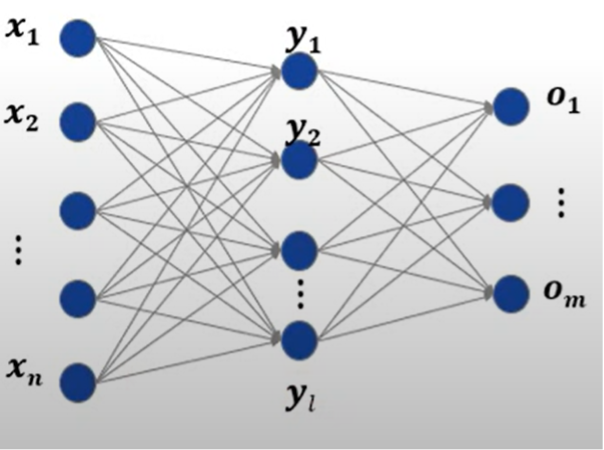

각 뉴런의 연결에는 가중치(Connection Weight)가 있다. 이 가중치를 최적화 하는것을 훈련(Training)이라고 한다.

### 신경망이 하는 일
- 1. Mapping을 학습함.
    - 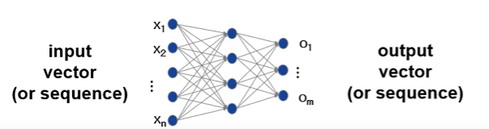
    - 위 사진처럼 입력 벡터(혹은 시퀀스)에서 출력 벡터(혹은 시퀀스)까지의 함수(짜여짐 혹은 연결성)를 학습한다.
        - Vector와 Sequence의 차이
            - Vector는 고정된 데이터 길이를 가지고 있으나, Sequence는 데이터의 길이를 변경할 수 있다.
            - 주로 자연어 분석 과정에서 언어별 문장 길이가 변화할 때에 Sequence를 사용한다.
- 2. 확률 분포를 학습함.
    - 확률 분포를 학습하면, 그 확률 분포를 토대로 데이터를 복제, 복구 혹은 변형시킬 수 있다.

### 퍼셉트론 (Perceptron)
#### 퍼셉트론이란
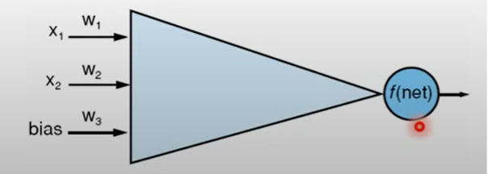
- 퍼셉트론은 다수의 신호를 입력받아 하나의 신호로 출력한다.
- 여기서 출력하는 신호는 0과 1 두가지 값을 가진다.
  - 0은 전류가 흐르지 않는다.
  - 1은 전류가 흐른다.
- 다수의 신호가 이전 층에서 뉴런으로 전달되면, 그 값들을 모두 더한 뒤 활성화 함수에 입력한다.

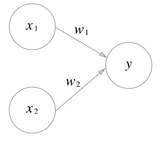

위 그림은 2개의 입력이 들어온 퍼셉트론이다.

- 입력 신호 : $x1, x2$
- 출력 신호 : $y$
- 가중치 : $w1, w2$      (가중치는 뉴런과 뉴런사이에 반드시 생성됨)
- 뉴런(노드) : 원

- 입력 신호가 뉴런에 보내질 때는 가중치가 곱해진다.
  - $x1 \rightarrow y = x1 * w1$
  - $x2 \rightarrow y = x2 * w2$

- 뉴런에서 받은 신호의 총 합이 임계값을 넘어설 때만 1을 출력한다.
  - 여기서 임계값은 세타($\theta$) 기호를 쓴다.
      - $w_1x_1 + w_2x_2 + \cdots +w_nx_n > \theta \rightarrow 1$
      - $w_1x_1 + w_2x_2 + \cdots +w_nx_n \leq \theta \rightarrow 1$

- 퍼셉트론은 여러개의 입력 신호 각각에 고유한 가중치를 가지고 있으며, 이는 결과(0과 1)에 주는 영향력을 조절하는 요소로 작용한다.
- 가중치가 클수록 해당 신호가 그만큼 중요함을 나타낸다.

### 편향
- 편향은 뉴런이 얼마나 쉽게 활성화되느냐를 제어하는 매개변수로 $b$를 사용한다.

### 활성화 함수
- 입력 신호의 총합을 출력 신호로 변환하는 함수를 일빈적으로 활성화 함수라고 한다.
- 입력 신호의 총합이 활성화(0 혹은 1)를 일으키는지를 정하는 역할을 한다.

#### 활성화 함수가 사용되는 이유
1. 비선형성
    - 퍼셉트론에서 출력되는 일련의 값들은 직선으로 표현된다. 따라서 직선의 형태를 갖는 모델은 단순한 모델링으로만 처리 가능한 문제에서만 유용하다.
    - 복잡한 모델링이 필요한 문제에서 다층의 퍼셉트론 층을 가져도 선형적 결과가 출력되어 의미가 없어진다.
1. 출력값의 범위를 제한할 수 있다.
    - 입력값과 편향값, 가중치를 모두 더한 값은 무한대의 범위를 가지므로 판별에 어려움을 준다.
    - 활성화 함수를 통해 이 출력값의 범위를 -1 ~ 1 와 같이 제한하여 표현할 수 있다.
        - 따라서 이를 통해 확률을 표현할 수 있도록 값을 정량화 할 수 있다. 

#### 활성화 함수의 종류
##### 계단 함수
- 게단 함수는 퍼셉트론에서 사용하는 활성화 함수이다.
- 위의 조건 분기 식처럼 입력이 0을 넘으면 1을 출력하고, 이외에는 0을 출력하는 함수이다.

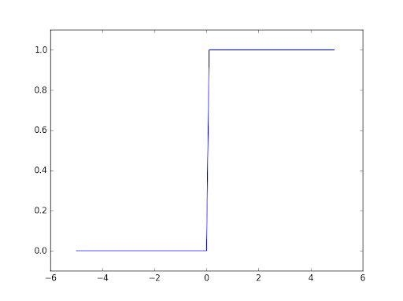

- 위 그림처럼 0을 기준으로 y값이 0과 1로 나뉜다.

##### 시그모이드 함수 (Sigmoid Function)
- 시그모이드 함수는 신경망에서 사용하는 활성화 함수 중 하나이다.
- S자 모양의 함수라는 뜻이다.

##### 렐루 함수 (Rectified Linear Unit)
- 비교적 최근에 만들어진 신경망 활성화 함수이다.
- 시그모이드 함수보다 많이 사용한다.

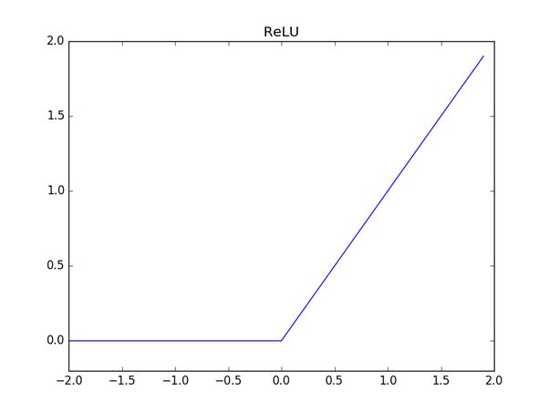

##### 출력층 활성화 함수

가장 마지막 층인 출력층에서 사용한다.
크게 항등함수와 소프트맥스(Softmax) 함수가 있다.

###### 항등함수
- 항등함수는 회귀(Regression)문제에서 주로 사용한다.
- 입력된 값을 그대로 출력층에 내보내 준다.

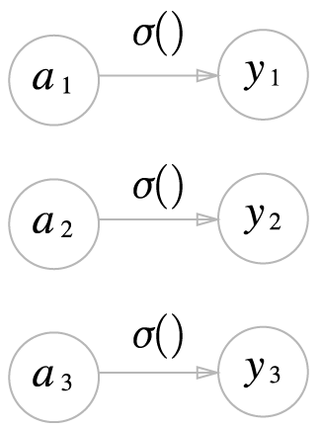

###### 소프트맥스(Softmax) 함수
- 소프트맥스는 분류(Classification)문제에서 주로 사용한다.
  - 함수의 출력은 0과 1 사이의 실수이며, 각 출력의 총합은 1이다.
        - = 확률과 같은 의미
  - 소프트맥스 함수를 적용해도 입력들의 대소관계는 변하지 않는다.

$y_k = \exp(a_k) \over \sum^n_{i=1}\exp(a_i)$

### 단층 퍼셉트론과 다층 퍼셉트론

- 단층 퍼셉트론 : 선형 영역만 표현가능
- 다층 퍼셉트론 : 비선형 영역도 표현가능

#### 단층 퍼셉트론 (Single layer perceptron)
층이 1개인 퍼셉트론이다.

첫번째 층을 Input Layer, 마지막 층을 Output Layer라고 한다.

#### 다층 퍼셉트론 (Multi layer perceptron)
층이 2개 이상인 퍼셉트론이다.

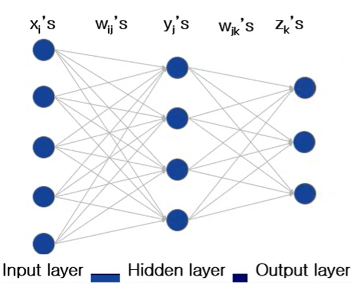
2층 퍼셉트론
- 입력층 : 0
- 은닉층 : 1
- 출력층 : 2

3층 퍼셉트론
- 입력층 : 0
- 은닉층1 : 1
- 은닉층2 : 2
- 출력층 : 3

$n$층 퍼셉트론
- 입력층 : 0
- 은닉층1 : 1
- 은닉층2 : 2
- $\cdots$
- 은닉층 $n-1$ : $n-1$
- 출력층 : $n$

첫번째 층을 Input Layer, 마지막 층을 Output Layer, 그 사이에 존재하는 층을 Hidden Layer라고 한다.

단층 퍼셉트론이 XOR문제를 해결할 수 없는 상황을 보완하기 위해 등장하였다.

층의 갯수에는 제한이 없으나, 층이 많아질수록 학습이 복잡해진다.

### 경사하강법 (Gradient Descent)
- 경사하강법은 에러율을 최소화하기 위한 최적화 방법이다.
- 에러를 미분하여 최소값을 가질때까지 가중치를 조정한다.

에러

$E=\frac{(o-d)^2}{2}=\frac{(f(\sum_iw_ix_i)d)^2}{2}$

출력패턴($o$)과 정답 출력의 차에서 미분의 편의를 위해 2로 나눠준 식이다.

출력패턴 $o$는

$o=f(net)=f(\sum_iw_ix_i)$

로 나타낼 수 있으며, 에러 식에서 $x$와 $d$는 고정값이므로 가중치 $w$를 어떻게 조정하냐에 따라 오류율이 변화하게 된다.

$E(W)$를 미분하게 되면,

$E(W) = \frac{\partial E}{\partial W} = \frac{\partial E}{\partial o} \frac{\partial E}{\partial net} \frac{\partial net}{\partial W} = (o-d)f'(net)X$

로 표현할 수 있다.

위의 두 식을 바탕으로 Update Rule을 정의하면,

$W^{t+1}=W^t-\eta*(o-d)o(1-o)X$

가 된다.
#### 경사하강법의 종류
##### 확률적 경사 하강법 (SGD)
기울어진 방향으로 일정 거리만 가겠다는 단순한 방법

$W \leftarrow W-\eta\frac{\partial L}{\partial W}$

- $W$ : 갱신할 가중치
- $\partial L \over \partial W$ : $W$에 대한 손실함수의 기울기
- $\eta$ : 학습률

##### 모멘텀 (Momentum)
공이 가속도에 영향을 받아 바닥을 구르듯 행동

$v=\alpha v-\eta \frac{\partial L}{\partial W}$

- $\alpha v$ : 물체에 외력이 없을 때, 서서히 움직이게 해주는 역할
- $v$ : 가속도(Velocity)

### 연쇄 법칙 (Chain Rule)
Gradient를 구하는 과정에서 사용되는 법칙.

$y=g(x), z=f(y)=f(g(x))$

$\frac{dz}{dx}=\frac{dz}{dy}\frac{dy}{dx}$

$z$를 $x$로 미분하기 위해 $z$를 $y$로 먼저 미분한 뒤, $y$를 $x$로 미분한 값에 곱해주는 방식이다.

### Bias
- 직선을 표현하기 위한 절편.

### 학습률 (Learning Rate)
학습률은 어떠한 모델이 학습 과정에서 가중치를 얼마나 변화시킬 것인지 결정하는 값이다.

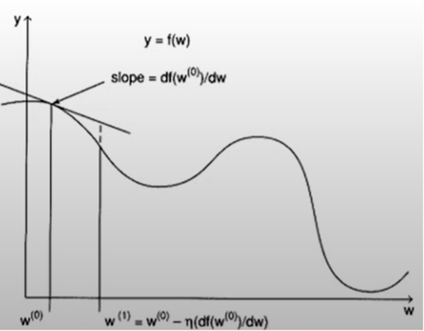

- 학습률이 너무 큰 경우, 한번에 너무 많은 구간을 이동하게 되므로 오류가 발생할 확률이 높아진다.
- 반대로 학습률이 너무 작은 경우, 한번에 너무 적은 구간을 이동하게 되므로 많은 반복이 필요해진다. 또한, 전역 최저값을 찾지 못하고, 지역 최저값에서 해멜 수

### 손실 함수 (Cost function)
손실 함수란 신경망이 학습할 수 있도록 해주는 지표이다. 모델의 출력값과 사용자가 원하는 출력값의 차이, 즉 오차를 말한다.

이 손실 함수 값이 최소화되도록 하는 가중치와 편향을 찾는 것이 바로 학습이다. 일반적인 손실 함수로 평균 제곱 오차(MSE)나 교차 엔트로피 오차(CEE)를 사용한다.

#### 손실함수를 사용하는 이유
신경망 학습에서 최적의 매개변수를 탐색할 때 손실함수의 값을 가능한 한 작게 하는 매개변수 값을 찾는다.

이때, 매개변수의 미분(기울기)을 계산하고, 그 미분 값을 토대로 매개변수 값을 갱신하는 과정을 반복한다.

손실 함수와는 달리 정확도는 매개변수의 변화에 둔감하고, 또한 변화가 있다하여도 불연속적으로 변화하기 때문에 미분을 할 수 없다.

미분이 되지 않으면 최적화를 할 수 없으므로 정확도가 아닌 손실 함수를 지표로 삼아 학습을 해나가는 것이다.

#### 손실함수의 종류

##### 평균 제곱 오차(Mean Squared Error : MSE)

계산이 간편하여 가장 많이 사용되는 손실 함수이다.

기본적으로 모델의 출력 값과 사용자가 원하는 출력 값 사이의 거리 차이를 오차로 사용한다.

그러나 오차를 계산할 때 단순히 거리 차이를 합산하여 평균내게 되면, 거리가 음수로 나왔을 때 합산된 오차가 실제 오차보다 줄어드는 경우가 생긴다.

그렇기 때문에 각 거리 차이를 제곱하여 합산한 후에 평균내는 것이다.

위의 식에서는 1/2를 곱하는 것으로 되어 있으나 실제로는 2가 아닌 전체 데이터의 수를 나누어 1/n을 곱해주어야 한다.

 - 거리 차이를 제곱하면 좋은 점은, 거리 차이가 작은 데이터와 큰 데이터 오차의 차이가 더욱 커진다는 점이다. 이렇게 되면 어느 부분에서 오차가 두드러지는지 확실히 알 수 있다는 장점이 있다.

##### 교차 엔트로피 오차(Cross Entropy Error : CEE)

기본적으로 분류(Classification) 문제에서 원-핫 인코딩(one-hot encoding)했을 경우에만 사용할 수 있는 오차 계산법이다.

위의 식에서 t값이 원-핫 인코딩된 벡터이고, 거기에다 모델의 출력 값에 자연로그를 취한 것이 곱해지는 형태이다.

결과적으로 교차 엔트로피 오차는 정답일 때의 모델 값에 자연로그를 계산하는 식이 된다.

#### 정리
1. MSE(mean squared error)
MSE는 회귀(regression) 용도의 딥러닝 모델을 훈련시킬때 많이 사용되는 손실 함수이다.

2. MAE(mean absolute error)
MAE는 MSE와 거의 비슷하다. 에러 제곱의 평균이 아니라 에러 절대값의 평균을 구해준다. MAE도 회귀 용도의 딥러닝 모델을 훈련시킬때 많이 사용된다.

3. binary crossentropy
만약 이진 분류기를 훈련하려면, binary crossentropy 손실함수를 사용하면 된다. 이진 분류기라는 것은 True 또는 False, 양성 또는 음성 등 2개의 클래스를 분류할 수 있는 분류기를 의미한다.

4. categorical crossentropy
분류해야할 클래스가 3개 이상인 경우, 즉 멀티클래스 분류에 사용됩니다. 라벨이 [0,1,0,0], [1,0,0,0], [0,0,1,0]과 같이 one-hot 형태로 제공될 때 사용된다. 따라서 categorical crossentropy는 멀티클래스 분류 문제의 손실함수로 사용되기에 적합하다.

### CNN

CNN은 Convolutional Neural Network의 약자로 기존 DNN에서 이미지나 영상과 같은 데이터를 처리할 때 발생하는 문제점들을 보완한 방법입니다.

## CNN의 처리방법

### 1. 픽셀화

아래와 같은 손글씨 이미지가 있다고 합시다.

이와 같은 이미지에 대해서 픽셀로 나눠볼 수 있습니다.

위의 빨간 네모 한칸을 1픽셀이라 생각하고, 이 픽셀에는 (R(0-255), G(0-255), B(0-255)) 사이의 컬러가 들어가 있습니다.

즉 한픽셀당 3차원의 값이 들어가게 되는 것입니다.

그러나 지금은 개념만 잡는 부분이기 때문에 이해하기 쉽도록 0과 1로만 구분이 된다고 생각해봅시다.

그렇게 된다면 아래와 같이 숫자 "8"을 나타낼 수 있습니다.
(흰 픽셀은 0, 나머지 픽셀은 1)

### 2. Convolution
딥러닝에서 사용하는 Convolution은 하나의 이미지로부터 픽셀의 연관성을 살린 여러 개의 이미지를 생성하는 것입니다.

n*n 크기의 이미지를 뽑아내서 같은 크기의 랜덤값을 가지고 있는 데이터와 픽셀을 곱해서 더해줍니다.

이때 랜덤값을 가지고 있는 n*n 데이터를 필터라고 부릅니다.

필터를 한픽셀씩 옮기며 새로운 이미지를 완성하는 방식입니다.

이렇게 새 이미지를 생성하는 방법이 Convolution입니다.

수학적으로 다시 정리해보겠습니다.

---
필터 갯수 = X  
필터 크기 = Y

이미지 크기 = Z * Z

-> 이때 만들어지는 새 이미지 크기와 갯수 : 크기 = (Z-Y+1) * (Z-Y+1), 갯수 = X개
---

이번에는 아까의 숫자 8 그림에 대해 Convolution 해봅시다.

아래 같은 3 * 3 필터 3개를 준비했다고 가정합시다.

그리고 아까 픽셀화를 한 숫자 8 이미지의 크기는 28 * 28입니다.

필터 1번이 한칸씩 움직이면서 새로운 이미지를 만들게 됩니다.

이때 만들어지는 이미지는 (28-3+1) * (28-3+1), 즉 26 * 26 크기의 새로운 이미지를 만들게 됩니다.

이러한 과정을 필터갯수인 3번 반복하면, 26 * 26의 이미지 3개가 완성됩니다.

필터의 갯수가 수백개이면, 이미지 하나를 서로다른 수백개의 이미지로 표현할 수 있습니다. 즉 이미지 100개에 필터 100개를 사용한다면 10000개의 Convolution된 이미지들을 얻을 수 있는 것입니다.

이것이 CNN의 핵심이자 "C"부분인 Convolution 과정이였습니다.

> 28 * 28 크기의 이미지를 Convolution 하면 이미지 크기가 줄어들게 되는데, 줄어든만큼 손실되었다고도 볼 수 있습니다. 이미지 크기를 padding이라는 것을 이용하여 유지하는 방법도 있습니다.

* padding : 원본 이미지의 상하좌우 테두리에 0 값을 갖는 데이터를 추가하여, Convolution을 적용한 크기가 원래의 크기와 동일하게 유지하도록 하는 방법입니다. 각 끝단 부분도 필터링을 동등하게 적용시키기 위해 사용하는 목적도 있습니다. 따라서 CNN으로 처리 된 이미지에 패딩을 추가하면 이미지를보다 정확하게 분석 할 수 있습니다. 

### 3. Pooling
Pooling은 CNN의 문제점 중 하나를 보완하는 방법입니다.

Convolution 과정을 통해서 많은 수의 이미지를 생성을 할 수 있었습니다.

큰 크기의 많은 이미지를 처리하려면 상당한 연산 시간이 걸리게 됩니다.

Convolution으로 이미지 수를 늘렸다면, Pooling으로는 이미지의 크기를 줄이게 됩니다.

n * n 크기의 Pooling 필터가 주어지면, n * n 크기중 가장 특성값 하나만 추출하게 되는 것입니다.

가장 많이 쓰게되는 pooling 방법은 Max Pooling입니다.
풀링된 픽셀내의 최댓값을 뽑아 내는 방법입니다.

아래처럼 숫자 8 이미지에서 2 * 2의 풀링 픽셀로 나누게된다면 파란 네모 한칸이 될 것입니다.

여기서 Max Pooling을 사용한다면 파란픽셀안의 4 픽셀값중 가장 큰 픽셀하나만 뽑혀서 재구성됩니다. 28 * 28크기가 14(28/2) * 14(28/2) 크기로 줄게 되는 것입니다.

#### 4. Flatten
Convolution과 Pooling을 반복하면 이미지의 갯수는 많아지면서 크기는 점점 줄어들게 됩니다. 바로 아래의 그림처럼 말입니다.

이렇게 해서 만들어지는 Output 이미지는 특정 이미지에서 얻어낸 특성 데이터라고 보면 됩니다.

이러한 2차원 특성 데이터를 1차원의 데이터로 변환시키는 과정이 Flatten 과정입니다.

아래 그림의 왼쪽이 2차원 특성 데이터이고, 이를 Flatten layer를 거치면서 오른쪽과 같은 1차원의 특성 데이터로 변환됩니다.

위의 이미지를 보면 Convolution과 Pooling을 반복하여 2차원 특성데이터들을 얻어내었고, 이를 Flatten층을 거쳐서 1차원 데이터로 변환하였습니다. 그 뒤에는 앞의 DNN과 같은 NN 층을 연결하여 1차원적인 OUTPUT를 얻어낼 수 있었습니다.

이미지 하나를 수백개의 이미지로 변환하고, 이 이미지들의 특성데이터들을 종합하여 1차원 데이터화 시키는 것입니다.

위의 그림과 같이 Convolution layer과 Pooling layer를 이용해 얻은 이미지들을 Dense와 같이 분류를 위한 학습 layer에 사용하기 위해서는  1차원 데이터로 바꾸어서 학습이 되어야 합니다.

### CNN 과정 정리

간단하게 모든 과정을 글로 설명해보자면, 고양이 사진 하나를 주었을때, 그 사진하나가 주어졌을 때.  
Convolution을 통해 다양한 털 색깔을 입힌 고양이 사진 수백장을 만들어 내고  
Pooling을 통해 고양이의 특징위주로 사진 크기를 줄입니다 (고양이의 귀, 코, 눈, 발바닥 등)  
마지막으로는 Flatten을 통해 2차원이라는 이미지를 1차원 데이터화 시키는 것입니다.

이러한 방법을 통해 이미지를 학습하는 것이 CNN입니다.